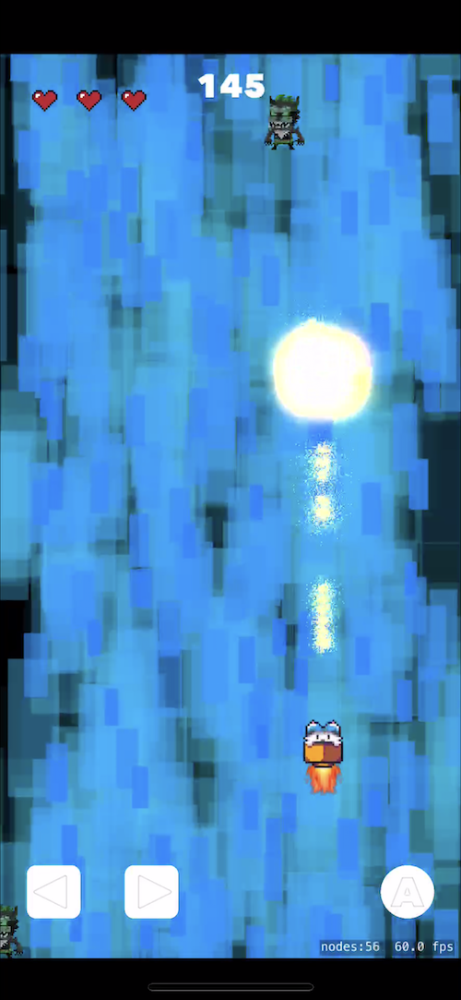

# Botbolt
## Authored by Joshua M. Choi
Botbolt is an interactive 2d game for the iPhone and iPad. It is written in Swift using Apple's SpriteKit and SceneKit SDK. This project was made for _Intro To Video Game Design_ with Professor Lawrence Wolk — a wonderful professor whom I've had the privillege of being a student.


## Video Demo
[The link to the video demo is here.](https://youtu.be/qTTBWPSm1Wk)

## Screenshots



## Narrative & Objective
The objective of the game is simple — destroy as many enemies (gremlin) that fall from the sky before the game ends. The game lasts for approximately 4 minutes, playing to the tune of [Bob Dylan's Like a Rolling Stone](https://www.youtube.com/watch?v=0fQjhSGQg4o). Using the nostalgic NES controls you can use the left, right, and action control buttons at the bottom of the screen. Every game has 3 lives. You lose a life if hit by a gremlin. There are no other chances to obtain more lives (high-score game). The number of gremlines that fall from the sky will increasingly get faster as the time passes or your score. This is calculated via a time interval variable that determines whether the current modolus of the score is equal to 0. If so, then the speed of time interval (which starts at 1) increases by 0.75s.

## Sprites & Objects
Most of the game's objects were created programmatically as a subclass of the ```SKSpriteNode``` object, including the action controls. The controls are initialized with a control type, ENUM value like so:
```
// MARK: - ControlNode
let actionControl = ControlNode(.fire, self)
actionControl.zPosition = 2
actionControl ...
```
The call backs are then passed to a protocol named ```ControlNodeDelegate```. The delegate method in this protocol allows the ```GameScene``` (or any other class that adopts this protocol) to then obtain the _type_ of control that was tapped.
```
// MARK: - ControlNodeDelegate
extension GameScene: ControlNodeDelegate {
    func tappedControl(_ control: ControlNode) {
        if control.type == .left {
            DispatchQueue.main.async {
                // Move left
                self.moveLeft(self)
            }
        } else if control.type == .right {
            DispatchQueue.main.async {
                // Move right
                self.moveRight(self)
            }
        } else if control.type == .fire {
            DispatchQueue.main.async {
                // Attack!
                self.fire(self)
            }
        }
    }
}
```

## Sprite Collisions
The game's sprite collisions are managed through the ```SKPhysicsContactDelegate``` which determines which of 2 ```SKPhysicsContact```'s   _*contactBody*_ attribute was the player, spark (the weapon used to destroy enemies), or the enemy. From here, the collisions are animated and removed from the scene.

## Particle Emitters
Most of the particle emitters were made via Apple's _*SpriteKit Particle File*_. The files are then initialized as ```SKEmitterNode``` objects that create explosions, sparks, and more. 

## Future Incentives
For the future, I plan to deploy an actual game application in the App Store and Google Play Store either by continuing development on Xcode or Unity.


## Requirements
- iOS 11+
- Xcode 10.2.1


## Installation
### Via Git 
1. Clone the repo to your local machine by running the following:
```
git clone https://www.github.com/HackShitUp/Botbolt.git
```
2. Navigate to the root directory and open *Botbolt.xcodeproj*.
3. Build and run by clicking the play button at the top left corner, or simply execute with _CMD + R_.

### Manually
1. Download the zip file from this repo via the drop down menu in green labeled _Clone or download_.
2. Unzip the file.
3. Navigate to the root directory and open *Botbolt.xcodeproj*.
4. Build and run by clicking the play button at the top left corner, or simply execute with _CMD + R_.

## Acknowledgements
I was inspired to use the Boost Buddies iOS app game for the main character inspiration. As a matter of fact, I used their character from their iMessage sticker pack.


Copyright (C) 2017 Nanogram, LLC. All rights reserved.
